# 象棋

> 邏輯設計實驗 Final Report
> 
> 設計者: 109062274 楊子慶
> 
> 主題: 大盤的明暗象棋

## 概述

### 功能概述

本 Project 旨在透過邏輯電路的架構與設計，來實作大盤象棋的規則與顯示功能。

於<font color=blue>正規大盤棋局</font>模式下，功能包含但不限於以下：

1. 棋盤、棋子、比賽鐘的顯示，包含漢字的美化設計與顏色的校正。
2. 以鍵盤操控己方游標選子、落子行為。移動游標採循環邏輯，即往棋盤的一側邊界遍歷會移動游標至棋盤的另一側。
3. 起手無回大丈夫：一旦選子就不能反悔，必須走子，走完子也不能悔棋。
4. 判定擊殺對方將、帥時，顯示該方勝利，屆時遊戲將結束。
5. 遊戲鐘邏輯：一方有兩個計時器，上方藍色為<font color=#3090f0>局計時器</font>，下方紅色為<font color=#f03030>回合計時器</font>。對方行動時己方的計時器會被停止，輪到我方時，局計時器會正常倒數，回合計時器會重設後開始倒數。重設值根據局計時器有以下可能
   1. 局計時器時間大於一分鐘 $\rightarrow$ 重置為一分鐘
   2. 局計時器時間小於十五秒 $\rightarrow$ 重置為十五秒
   3. 其他 $\rightarrow$ 重置為與局計時器同時
6. 七段顯示器邏輯：與遊戲鐘同步，可使用鍵盤 `backspace` 或 push button 來切換顯示當前玩家之局計時器、回合計時器；切換玩家時，七段顯示器會跟著切換成該玩家的回合計時器。

於<font color=blue>自創娛樂性質的大盤暗棋</font>模式下，規則設計與功能包含但不限於以下：

1. 使用 DIP switch 切換正規／暗棋大盤模式。
2. 使用 Push button 亂數洗棋，可以重複洗棋。
3. 雙方玩家皆可選擇未被翻開之棋子，將其翻開；翻開後，該子的使用所有權同正規比賽：僅限於該顏色的一方。
4. 先發制人：翻開後的棋子可以直接攻擊未被翻開的棋子。若為不同陣營，則直接吃掉，且無法知曉吃掉之子為何（當然，若取得對方將、帥之首級，則比賽結束，明示勝方），以此增進遊戲複雜與趣味性；若陣營相同，則將被攻擊之同陣營棋子翻開，攻擊之棋子留在原地不動。
5. 其餘規則繼承正式大盤之規則。

### 硬體概述

本 Final Project 使用的硬體設備有

1. VGA 螢幕：自備可攜式螢幕，可支援長寬比 4:3，解析度上限 1080p。用來顯示棋盤、棋盤美術、棋子、游標、四組計時器、勝敗圖示等。
2. Keyboard：配給之鍵盤，使用左方主要鍵位區。
   1. 紅方： $O$、$L$、$K$、$:$ 鍵盤按鍵來上、下、左、右遍歷棋盤上的紅方游標（橘色）
   2. `rshift` 紅方選定棋子、落子
   3. 黑方同理可用 $W$、$S$、$A$、$D$ 遍歷  
   4. `lshift` 黑方選定棋子、落子
   5. `backspace` 切換顯示的局／回合計時器
   6. `space` 開始／暫停遊戲計時

3. Push button：使用三個 push button，分別為 global reset、開始／暫停遊戲計時，以及切換顯示的局／回合計時器。
4. DIP switch：使用一個 DIP switch 來決定正規／暗棋大盤模式。
5. Seven Segment Display：用來顯示當前玩家之局／回合時鐘。
6. LEDs：使用三個 LED，最右側兩個表示「遊戲進行／紅方勝／黑方勝」；另外一個顯示在暗棋模式下是否亂數洗棋準備完成。

### 架構概述

先附上解析度很高的模組架構的依賴關係圖。

與過往相同，模組的分類採與 Java 相同的大駝峰式命名規則（小寫開頭的 `vga_controller` 是本課程提供的 template code，為尊重撰寫者而保留原名），模組的分群方法為基於其功能性進行區分，以群組為單位放在下圖標示的檔案結構中；不隸屬於任何群組者，模組名即為檔名。


整體的邏輯設計可分為四部分：前端、後端、訊號處理以及訊號生成。

1. 前端 `DisplayEngine`：負責解析資料結構並顯示於 VGA 螢幕，針對下列四種物件：
   1. `BoardDisplay`：棋盤、棋盤美術、勝敗圖示
   2. `ChessDisplay::PixelChess`：棋子顯示
   3. `ChessDisplay::PixelEffectFilter`：游標特效顯示
   4. `PlxelPlayerTimerManager`：四個比賽時鐘顯示
2. 後端為邏輯處理，分為兩部分：
   1. `GameLogic`：處理遊戲邏輯
   2. `TimerManager`：獨立處理比賽時鐘的邏輯
3. 訊號處理：
   1. `ButtonPressArray`：Push Button 長短按處理
   2. `KeyboardReader`：鍵盤解析與長短按處理
   3. `SignalIterator`：根據後端資料，產生七段顯示器輸出
4. 訊號生成：
   1. `vga_controller`：給定之模組，生成 vga 縱橫訊號同步點。
   2. `FrequencyManager`：產生指定的 clock，以及七段顯示器的迭代訊號。

## 接口規格

### `Main` module (I/O table)

| Port     |  `clk`   |       `pb_rst`       |             `pb_swap`              |         `pb_random`          |
| -------- | :------: | :------------------: | :--------------------------------: | :--------------------------: |
| Type     |  Input   |        Input         |               Input                |            Input             |
| Size     |    1     |          1           |                 1                  |              1               |
| Location |    W5    |         W19          |                T17                 |             T18              |
| Meaning  | 全局時脈 | 全局重設 Push Button | 切換七段顯示器之輸出的 Push Button | 暗棋模式下的洗棋 Push Button |

| Port     |    `PS2_DATA`    |    `PS2_CLK`     |            `dip_hidden_game`            |
| -------- | :--------------: | :--------------: | :-------------------------------------: |
| Type     |      Inout       |      Inout       |                  Input                  |
| Size     |        1         |        1         |                    1                    |
| Location |       B17        |       C17        |                   R2                    |
| Meaning  | PS2 協議資料接口 | PS2 協議時脈接口 | 切換正規大盤／暗棋<br>模式的 DIP switch |

| Port     |                     `ssd_o`                      |             `ssd_ctl`             |
| -------- | :----------------------------------------------: | :-------------------------------: |
| Type     |                      Output                      |              Output               |
| Size     |                        8                         |                 4                 |
| Location | `[7:0]` 依序為<br>W7, W6, U8, V8, U5, V5, U7, V7 | `[3:0]` 依序為<br/>W4, V4, U4, U2 |
| Meaning  |                  七段顯示器陰極                  |          七段顯示器陽極           |

| Port     |               `vgaRed`               |              `vgaGreen`               |               `vgaBlue`               |
| -------- | :----------------------------------: | :-----------------------------------: | :-----------------------------------: |
| Type     |                Output                |                Output                 |                Output                 |
| Size     |                  4                   |                   4                   |                   4                   |
| Location | `[3:0]` 依序為<br>N19, J19, H19, G19 | `[3:0]` 依序為<br/>D17, G17, H17, J17 | `[3:0]` 依序為<br/>J17, K17, L17, N17 |
| Meaning  |           VGA 紅色訊號通道           |           VGA 綠色訊號通道            |           VGA 藍色訊號通道            |

| Port     |  `hsync`   |  `vsync`   |            `LED`             |
| -------- | :--------: | :--------: | :--------------------------: |
| Type     |   Output   |   Output   |            Output            |
| Size     |     1      |     1      |              3               |
| Location |    P19     |    R19     | `[2:0]` 依序為 U19, E19, U16 |
| Meaning  | 橫同步訊號 | 縱同步訊號 |           LED 輸出           |

## 各模組規格

> 注意，`vga_controller`, `KeyboardDecoder`, `KeyboardCtrl` 和 `Ps2Interface` 為給定之模組，故省略規格敘述。

### `DisplayEngine` module

| Input   | `vga_clk` |   `rst_n`    |   `h_cnt`    |   `v_cnt`    |
| ------- | :-------: | :----------: | :----------: | :----------: |
| Size    |     1     |      1       |      12      |      12      |
| Meaning | VGA 時脈  | 全域重設訊號 | 橫向掃描訊號 | 縱向掃描訊號 |

| Input   |   `rr_timer`   |  `rt_timer`  |   `br_timer`   |  `bt_timer`  |
| ------- | :------------: | :----------: | :------------: | :----------: |
| Size    |       16       |      16      |       16       |      16      |
| Meaning | 紅方回合計時器 | 紅方局計時器 | 黑方回合計時器 | 黑方全局時器 |

| Input   | `chess_arr` | `effect_arr` | `result` | `pixel`  |
| ------- | :---------: | :----------: | :------: | :------: |
| Type    |    Input    |    Input     |  Input   |  Output  |
| Size    |     450     |     180      |    2     |    12    |
| Meaning |  棋子陣列   |   特效陣列   | 遊戲結果 | 輸出像素 |

### `BoardDisplay` module

| Input   | `vga_clk` |   `rst_n`    |   `h_cnt`    |   `v_cnt`    |
| ------- | :-------: | :----------: | :----------: | :----------: |
| Size    |     1     |      1       |      12      |      12      |
| Meaning | VGA 時脈  | 全域重設訊號 | 橫向掃描訊號 | 縱向掃描訊號 |

| Input   |   `rr_timer`   |  `rt_timer`  |   `br_timer`   |  `bt_timer`  |
| ------- | :------------: | :----------: | :------------: | :----------: |
| Size    |       16       |      16      |       16       |      16      |
| Meaning | 紅方回合計時器 | 紅方局計時器 | 黑方回合計時器 | 黑方全局時器 |

| Input   | `result` | `pixel`  |
| ------- | :------: | :------: |
| Type    |  Input   |  Output  |
| Size    |    2     |    12    |
| Meaning | 遊戲結果 | 輸出像素 |

### `KeyboardReader` module

| Port    | `clk`  |   `rst_n`    | `clk_100Hz` |  `PS2_DATA`  |  `PS2_CLK`   |
| ------- | :----: | :----------: | :---------: | :----------: | :----------: |
| Type    | Input  |    Input     |    Input    |    Inout     |    Inout     |
| Size    |   1    |      1       |      1      |      1       |      1       |
| Meaning | 快時脈 | 全域重設訊號 | 100Hz 時脈  | PS2 協議資料 | PS2 協議時脈 |

| Input   | `s_key_up` | `l_key_up` | `s_key_dn` | `l_key_dn` |
| ------- | :--------: | :--------: | :--------: | :--------: |
| Size    |     1      |     1      |     1      |     1      |
| Meaning |  短 O 鍵   |  長 O 鍵   |  短 L 鍵   |  長 L 鍵   |

| Input   | `s_key_lf` | `l_key_lf` | `s_key_rt` | `l_key_rt` |
| ------- | :--------: | :--------: | :--------: | :--------: |
| Size    |     1      |     1      |     1      |     1      |
| Meaning |  短 K 鍵   |  長 K 鍵   |  短 : 鍵   |  長 : 鍵   |

| Input   | `s_key_w` | `l_key_w` | `s_key_s` | `l_key_s` |
| ------- | :-------: | :-------: | :-------: | :-------: |
| Size    |     1     |     1     |     1     |     1     |
| Meaning |  短 W 鍵  |  長 W 鍵  |  短 S 鍵  |  長 S 鍵  |

| Input   | `s_key_a` | `l_key_a` | `s_key_d` | `l_key_d` |
| ------- | :-------: | :-------: | :-------: | :-------: |
| Size    |     1     |     1     |     1     |     1     |
| Meaning |  短 A 鍵  |  長 A 鍵  |  短 D 鍵  |  長 D 鍵  |

| Input   | `s_key_up` | `l_key_up` | `s_key_dn` | `l_key_dn` |
| ------- | :--------: | :--------: | :--------: | :--------: |
| Size    |     1      |     1      |     1      |     1      |
| Meaning |  短 O 鍵   |  長 O 鍵   |  短 L 鍵   |  長 L 鍵   |

| Input   | `s_key_lshift` | `s_key_rshift` | `s_key_space` | `s_key_bkspace` |
| ------- | :------------: | :------------: | :-----------: | :-------------: |
| Size    |       1        |       1        |       1       |        1        |
| Meaning |    短 K 鍵     |    長 K 鍵     |    短 : 鍵    |     長 : 鍵     |

### In `GameLogic.v` file

#### `GameLogic` module

| Port    | `user_clk` |   `rst_n`    |
| ------- | :--------: | :----------: |
| Type    |   Input    |    Input     |
| Size    |     1      |      1       |
| Meaning |   快時脈   | 全域重設訊號 |

| Input   | `s_key_up` | `l_key_up` | `s_key_dn` | `l_key_dn` |
| ------- | :--------: | :--------: | :--------: | :--------: |
| Size    |     1      |     1      |     1      |     1      |
| Meaning |  短 O 鍵   |  長 O 鍵   |  短 L 鍵   |  長 L 鍵   |

| Input   | `s_key_lf` | `l_key_lf` | `s_key_rt` | `l_key_rt` |
| ------- | :--------: | :--------: | :--------: | :--------: |
| Size    |     1      |     1      |     1      |     1      |
| Meaning |  短 K 鍵   |  長 K 鍵   |  短 : 鍵   |  長 : 鍵   |

| Input   | `s_key_w` | `l_key_w` | `s_key_s` | `l_key_s` |
| ------- | :-------: | :-------: | :-------: | :-------: |
| Size    |     1     |     1     |     1     |     1     |
| Meaning |  短 W 鍵  |  長 W 鍵  |  短 S 鍵  |  長 S 鍵  |

| Input   | `s_key_a` | `l_key_a` | `s_key_d` | `l_key_d` |
| ------- | :-------: | :-------: | :-------: | :-------: |
| Size    |     1     |     1     |     1     |     1     |
| Meaning |  短 A 鍵  |  長 A 鍵  |  短 D 鍵  |  長 D 鍵  |

| Input   | `s_key_up` | `l_key_up` | `s_key_dn` | `l_key_dn` |
| ------- | :--------: | :--------: | :--------: | :--------: |
| Size    |     1      |     1      |     1      |     1      |
| Meaning |  短 O 鍵   |  長 O 鍵   |  短 L 鍵   |  長 L 鍵   |

| Input   | `s_key_lshift` | `s_key_rshift` | `s_key_space` | `s_key_bkspace` |
| ------- | :------------: | :------------: | :-----------: | :-------------: |
| Size    |       1        |       1        |       1       |        1        |
| Meaning |    短 K 鍵     |    長 K 鍵     |    短 : 鍵    |     長 : 鍵     |

#### `RandomChessGenerator` module

| Input   | `clk` |   `rst_n`    | `random_seed` |       `ready`        | `chess_arr` |
| ------- | :---: | :----------: | :-----------: | :------------------: | :---------: |
| Size    |   1   |      1       |       5       |          1           |     128     |
| Meaning | 時脈  | 全域重設訊號 |   亂數種子    | 亂數棋子已經生成完畢 |             |

### In `TimerManager.v` file

#### `TimerManager` module

| Input   | `clk_100Hz`  |   `rst_n`    |   `start`    |   `switch`   |               `swap`                |
| ------- | :----------: | :----------: | :----------: | :----------: | :---------------------------------: |
| Size    |      1       |      1       |      1       |      1       |                  1                  |
| Meaning | $100Hz$ 時脈 | 全域重設訊號 | 啟動時鐘訊號 | 玩家切換訊號 | 切換 `clock` 輸出的局／回合時鐘訊號 |

| Output  |   `rr_timer`   |  `rt_timer`  |   `br_timer`   |  `bt_timer`  |
| ------- | :------------: | :----------: | :------------: | :----------: |
| Size    |       16       |      16      |       16       |      16      |
| Meaning | 紅方回合計時器 | 紅方局計時器 | 黑方回合計時器 | 黑方全局時器 |

| Output  |              `clock`               |   `times_up`   | `state`  |
| ------- | :--------------------------------: | :------------: | :------: |
| Size    |                 16                 |       1        |    2     |
| Meaning | 當前 `swap` 選擇之局／回合時鐘訊號 | 是否已倒數到頭 | 內部狀態 |

#### `PlayerTimer` module

| Input   | `clk_100Hz`  |   `rst_n`    |       `en`       |
| ------- | :----------: | :----------: | :--------------: |
| Size    |      1       |      1       |        1         |
| Meaning | $100Hz$ 時脈 | 全域重設訊號 | 倒數 enable 訊號 |

| Output  | `round_clock` | `total_clock` |
| ------- | :-----------: | :-----------: |
| Size    |      16       |      16       |
| Meaning |  回合計時器   |   局計時器    |

#### `HourClock` module

| Port    |     `clk`      |   `rst_n`    |       `en`       | `clock`  |
| ------- | :------------: | :----------: | :--------------: | :------: |
| Type    |     Input      |    Input     |      Input       |  Output  |
| Size    |       1        |      1       |        1         |    16    |
| Meaning | 更新倒數之時脈 | 全域重設訊號 | 倒數 enable 訊號 | 小時時鐘 |

#### `RoundClock` module

| Input   |     `clk`      |   `rst_n`    |       `en`       |
| ------- | :------------: | :----------: | :--------------: |
| Size    |       1        |      1       |        1         |
| Meaning | 更新倒數之時脈 | 全域重設訊號 | 倒數 enable 訊號 |

| Port    | `to_inject`  | `inject_num` |   `clock`    |
| ------- | :----------: | :----------: | :----------: |
| Type    |    Input     |    Input     |    Output    |
| Size    |      1       |      16      |      16      |
| Meaning | 準備插入數字 | 欲插入的數字 | 回合鐘之輸出 |

#### `OneDigitCounter` module

| Port    | `clk` |   `rst_n`    |        `en`        |
| ------- | :---: | :----------: | :----------------: |
| Type    | Input |    Input     |       Input        |
| Size    |   1   |      1       |         1          |
| Meaning | Clock | Global reset | Enable of counting |

| Port    |       `direction`        |            `to_inject`            |    `inject_num`     |
| ------- | :----------------------: | :-------------------------------: | :-----------------: |
| Type    |          Input           |               Input               |        Input        |
| Size    |            1             |                 1                 |          4          |
| Meaning | Specify up/down counting | Control signal of value injection | The value to inject |

| Port    |             `val_after_cry`              |          `num`          |           `cry`           |
| ------- | :--------------------------------------: | :---------------------: | :-----------------------: |
| Type    |                  Input                   |         Output          |          Output           |
| Size    |                    1                     |            4            |             1             |
| Meaning | Specify specify the value after carrying | The current digit value | The current carry up/down |

### In `PixelPlayerTimerManager.v` file

#### `PixelPlayerTimerManager` module

| Input   |   `h_cnt`    |   `v_cnt`    |
| ------- | :----------: | :----------: |
| Size    |      1       |      1       |
| Meaning | 橫向掃描訊號 | 縱向掃描訊號 |

| Input   |   `rr_timer`   |  `rt_timer`  |   `br_timer`   |  `bt_timer`  |
| ------- | :------------: | :----------: | :------------: | :----------: |
| Size    |       16       |      16      |       16       |      16      |
| Meaning | 紅方回合計時器 | 紅方局計時器 | 黑方回合計時器 | 黑方全局時器 |

| Output  |           `valid`            |  `pixel`   |
| ------- | :--------------------------: | :--------: |
| Size    |              16              |     12     |
| Meaning | 是否在像素七段顯示器的範圍內 | 輸出之像素 |

#### `PixelPlayerTimer` module

| Input   |   `h_cnt`    |   `v_cnt`    |
| ------- | :----------: | :----------: |
| Size    |      1       |      1       |
| Meaning | 橫向掃描訊號 | 縱向掃描訊號 |

| Input   |  `round`   | `total`  |
| ------- | :--------: | :------: |
| Size    |     16     |    16    |
| Meaning | 回合計時器 | 局計時器 |

| Output  |           `valid`            |  `pixel`   |
| ------- | :--------------------------: | :--------: |
| Size    |              16              |     12     |
| Meaning | 是否在像素七段顯示器的範圍內 | 輸出之像素 |

#### `PixelTimer` module

| Input   |   `h_cnt`    |   `v_cnt`    | `timer`  |
| ------- | :----------: | :----------: | :------: |
| Size    |      1       |      1       |    16    |
| Meaning | 橫向掃描訊號 | 縱向掃描訊號 | 時鐘訊號 |

| Output  |  `pixel`   |
| :-----: | :--------: |
|  Size   |     12     |
| Meaning | 輸出之像素 |

#### `PixelSSD` module

| Port    |     `h_pos`      |     `v_pos`      | `timer`  |  `pixel`   |
| ------- | :--------------: | :--------------: | :------: | :--------: |
| Type    |      Input       |      Input       |  Input   |   Output   |
| Size    |        1         |        1         |    16    |     12     |
| Meaning | 相對橫向掃描訊號 | 相對縱向掃描訊號 | 時鐘訊號 | 輸出之像素 |

### In `ChessDisplay.v` dile

#### `ChessDisplay` module

| Input   | `vga_clk` |   `h_cnt`    |   `v_cnt`    |
| ------- | :-------: | :----------: | :----------: |
| Size    |     1     |      1       |      1       |
| Meaning | VGA 時脈  | 橫向掃描訊號 | 縱向掃描訊號 |

| Input   | `chess_arr`  | `effect_arr` |
| ------- | :----------: | :----------: |
| Size    |     450      |     180      |
| Meaning | 棋子資料陣列 | 特效資料陣列 |

| Output  |        `valid`         |  `pixel`   |
| ------- | :--------------------: | :--------: |
| Size    |           16           |     12     |
| Meaning | 是否在像素棋子的範圍內 | 輸出之像素 |

#### `PixelChess` module

| Input   | `vga_clk` |     `h_pos`      |     `v_pos`      |
| ------- | :-------: | :--------------: | :--------------: |
| Size    |     1     |        1         |        1         |
| Meaning | VGA 時脈  | 相對橫向掃描訊號 | 相對縱向掃描訊號 |

|  Input  | `chess`  |
| :-----: | :------: |
|  Size   |    5     |
| Meaning | 棋子資料 |

| Output  |        `valid`         |  `pixel`   |
| ------- | :--------------------: | :--------: |
| Size    |           16           |     12     |
| Meaning | 是否在像素棋子的範圍內 | 輸出之像素 |

#### `PixelEffectFilter` module

| Input   |     `h_pos`      |     `v_pos`      |
| ------- | :--------------: | :--------------: |
| Size    |        1         |        1         |
| Meaning | 相對橫向掃描訊號 | 相對縱向掃描訊號 |

|  Input  |                    `pixel_i`                     | `effect` |
| :-----: | :----------------------------------------------: | :------: |
|  Size   |                        12                        |    2     |
| Meaning | 欲家特效之像素（目前僅為無特效時的輸出，可擴展） | 特效資料 |

| Output  |        `valid`         | `pixel_o`  |
| ------- | :--------------------: | :--------: |
| Size    |           16           |     12     |
| Meaning | 是否在像素棋子的範圍內 | 輸出之像素 |

### In `PressProcessing.v` file

#### `ButtonPressArray` module

| Port    |        `clk_fast`         |          `clk_slow`           |   `rst_n`    |
| ------- | :-----------------------: | :---------------------------: | :----------: |
| Type    |           Input           |             Input             |    Input     |
| Size    |             1             |               1               |      1       |
| Meaning | Fast clock for debouncing | Slow clock for signal parsing | Global reset |

| Port    |     `sig_arr`     |    `s_sig_arr_o`     |    `l_sig_arr_o`    |
| ------- | :---------------: | :------------------: | :-----------------: |
| Type    |       Input       |        Output        |       Output        |
| Size    | `SIZE` parameter  |   `SIZE` parameter   |  `SIZE` parameter   |
| Meaning | Push button array | Short pressing array | Long pressing array |

#### `PressSignalArray` module

| Port    |  `user_clk`  |   `rst_n`    |
| ------- | :----------: | :----------: |
| Type    |    Input     |    Input     |
| Size    |      1       |      1       |
| Meaning | Clock signal | Global reset |

| Port    |     `sig_arr`     |    `s_sig_arr_o`     |    `l_sig_arr_o`    |
| ------- | :---------------: | :------------------: | :-----------------: |
| Type    |       Input       |        Output        |       Output        |
| Size    | `SIZE` parameter  |   `SIZE` parameter   |  `SIZE` parameter   |
| Meaning | Push button array | Short pressing array | Long pressing array |

#### `ButtonPress` module

| Port    |        `clk_fast`         |          `clk_slow`           |   `rst_n`    |
| ------- | :-----------------------: | :---------------------------: | :----------: |
| Type    |           Input           |             Input             |    Input     |
| Size    |             1             |               1               |      1       |
| Meaning | Fast clock for debouncing | Slow clock for signal parsing | Global reset |

| Port    |       `sig`        |       `s_sig_o`       |      `l_sig_o`       |
| ------- | :----------------: | :-------------------: | :------------------: |
| Type    |       Input        |        Output         |        Output        |
| Size    |         1          |           1           |          1           |
| Meaning | Push button signal | Short pressing signal | Long pressing signal |

#### `PressSignal` module

| Port    | `clk` |   `rst_n`    |       `sig`        |       `s_sig_o`       |      `l_sig_o`       |
| ------- | :---: | :----------: | :----------------: | :-------------------: | :------------------: |
| Type    | Input |    Input     |       Input        |        Output         |        Output        |
| Size    |   1   |      1       |         1          |           1           |          1           |
| Meaning | Clock | Global reset | Push button signal | Short pressing signal | Long pressing signal |

#### `Debounce` module

| Port    | `clk` |   `rst_n`    |       `but`        |     `db_but`     |
| ------- | :---: | :----------: | :----------------: | :--------------: |
| Type    | Input |    Input     |       Input        |      Output      |
| Size    |   1   |      1       |         1          |        1         |
| Meaning | Clock | Global reset | Push button signal | Debounced signal |

### In `FrequencyManager.v` file

#### `FrequencyManager` module

| I/O     |    `clk`     |   `rst_n`    |          `fd_clk_arr`           |               `iter_sig`                |
| ------- | :----------: | :----------: | :-----------------------------: | :-------------------------------------: |
| Type    |    Input     |    Input     |             Output              |                 Output                  |
| size    |      1       |      1       |             `NUMS`              |              `ITER_WIDTH`               |
| meaning | Clock signal | Global reset | clocks after dividing frequency | Iterating signal mostly for SSD display |

#### `FrequencyDivider` module

| I/O     |                `f_in`                |   `rst_n`    |             `f_out`             |               `iter_sig`                |
| ------- | :----------------------------------: | :----------: | :-----------------------------: | :-------------------------------------: |
| Type    |                Input                 |    Input     |             Output              |                 Output                  |
| size    |                  1                   |      1       |                1                |              `ITER_WIDTH`               |
| meaning | Input signal to be frequency-divided | Global reset | clocks after dividing frequency | Iterating signal mostly for SSD display |

### In `SignalIterator.v` file

#### `SignalIterator` module

| Port    |       `nums`       |               `ssd_ctl_en`                |
| ------- | :----------------: | :---------------------------------------: |
| Type    |       Input        |                   Input                   |
| Size    |         16         |                     2                     |
| Meaning | Four binary digits | Selecting signal of seven segment display |

| Port    |          `ssd_ctl`          |           `ssd_o`            |
| ------- | :-------------------------: | :--------------------------: |
| Type    |           Output            |            Output            |
| Size    |              4              |              8               |
| Meaning | Seven segment anode control | Seven segment display output |

#### `SevenSegmentDisplay` module

| Port    |    `num`     |               `ssd_o`                |
| ------- | :----------: | :----------------------------------: |
| Type    |    Input     |                Output                |
| Size    |      4       |                  8                   |
| Meaning | Binary digit | Decoded seven segment display output |

### Block Memory

使用給定之 `PicTrans.exe` 由 `.jpg` 檔產生 `.coe` 檔，再透過 Vivado 生成記憶體模組。

> 注意到唯獨雙方主帥的命名與其他棋子不同，這將在問題與討論提及。

| Module  |                  `GeneralBK`                  |               `advisor_bk_mem`               |               `elephant_bk_mem`               |
| ------- | :-------------------------------------------: | :------------------------------------------: | :-------------------------------------------: |
| Content |                      將                       |                      士                      |                      象                       |
| Source  |  |  |  |

| Module  |              `chariot_bk_mem`               |               `horse_bk_mem`                |               `cannon_bk_mem`                |
| ------- | :-----------------------------------------: | :-----------------------------------------: | :------------------------------------------: |
| Content |                     車                      |                     馬                      |                      砲                      |
| Source  |  |  |  |

| Module  |               `soldier_bk_mem`                |                 `GeneralRD`                 |              `advisor_rd_mem`              |
| ------- | :-------------------------------------------: | :-----------------------------------------: | :----------------------------------------: |
| Content |                      卒                       |                     帥                      |                     仕                     |
| Source  |  |  |  |

| Module  |              `elephant_rd_mem`              |             `chariot_rd_mem`              |              `horse_rd_mem`               |
| ------- | :-----------------------------------------: | :---------------------------------------: | :---------------------------------------: |
| Content |                     相                      |                    俥                     |                    傌                     |
| Source  |  |  |  |

| Module  |              `cannon_rd_mem`               |              `soldier_rd_mem`               |                `win_mem`                |
| ------- | :----------------------------------------: | :-----------------------------------------: | :-------------------------------------: |
| Content |                     炮                     |                     兵                      |                   勝                    |
| Source  |  |  |  |

| Module  |                `river_l_mem`                |                `river_r_mem`                |                `no_talk_mem`                |                `no_regret_mem`                |
| ------- | :-----------------------------------------: | :-----------------------------------------: | :-----------------------------------------: | :-------------------------------------------: |
| Content |                    楚河                     |                    漢界                     |               觀棋不語真君子                |                起手無回大丈夫                 |
| Source  |  |  | 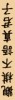 | 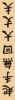 |

## 邏輯設計與實作

### 架構雛形

本 Final Project 的架構採用軟體設計中常用的典範：前後端架構，將遊戲分為邏輯處理與資料顯示兩大部分，即後端與前端。

後端需要正確的讀取使用者的輸入並處理資料，前端則不斷讀取後端的資料，並顯示於前端。

與軟體設計最有趣的差別在於，軟體中前端需要被動的透過 Observer，或後端主動的通知前端才能更新顯示，但硬體邏輯電路設計中，僅需要將後端的資料透過 `wire` 連線至前端即可實現。

### Block Diagram


### `GameLogic` 後端架構

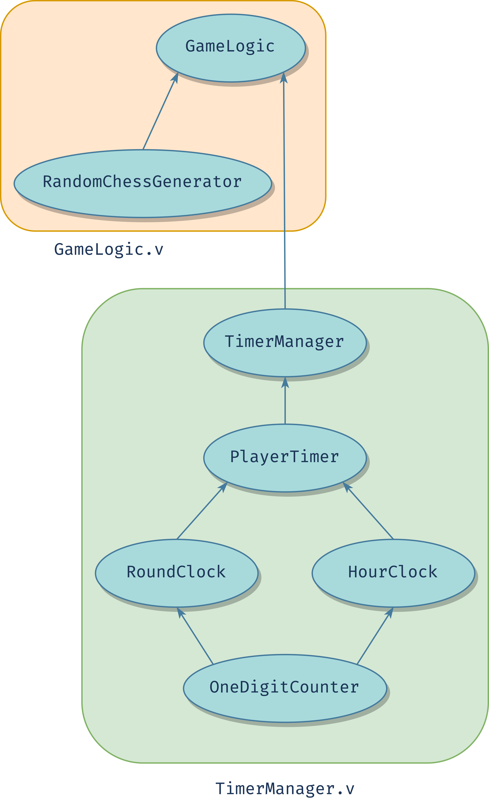

#### 棋子邏輯

首先定義棋子的資料，象棋一方有將士象車馬炮卒，共 $7$ 子，故紅黑雙方有 $7+7=14$ 種棋子，若考慮空子，則共有 $15$ 種可能，於是我採用 $4$ bits ($\lceil\log_2{14}\rceil = 4$) 來作為棋子的資料結構。

更進一步的，由於暗棋模式下需要「覆蓋的棋子」，故我將原本 $4$ bits 的棋子陣列擴展成 $5$ bits，最高位為 $1 \texttt{ (HIDDEN)}$ 表被覆蓋，$\texttt{0 (SHOWING)}$ 表明示。

定義棋子資料映射如下，僅顯示 $4$ bits 的資料部分，$5th$ bit 如上述規則。

特別注意到，要判定某子為紅子的方法正好是確認 $4th$ bit 是否為 $1$；要判斷黑子，除了 $4th$ bit 為 $0$ 外，還需要判斷 `[2:0]` 是否非 $0$。

| 棋子 key | 無子 |  將  |  士  |  象  |  車  |  馬  |  砲  |  卒  |
| -------- | :--: | :--: | :--: | :--: | :--: | :--: | :--: | :--: |
| value    |  0   |  1   |  2   |  3   |  4   |  5   |  6   |  7   |

| 棋子 key |  帥  |  仕  |  相  |  俥  |  傌  |  炮  |  兵  |
| -------- | :--: | :--: | :--: | :--: | :--: | :--: | :--: |
| value    |  8   |  9   |  10  |  11  |  12  |  13  |  14  |

#### 特效邏輯

特效是游標顯示的方法，也是對未來擴展性的保留。

我設計 $3$ 種特效：紅方游標、黑方游標以及被選擇特效，加上無特效總共 $4$ 種可能，故使用 $2$ bits 來作為資料結構。

定義特效資料映射如下。

| 特效 key | 無特效 | 黑方游標 | 紅方游標 | 被選擇特效 |
| -------- | :----: | :------: | :------: | :--------: |
| value    |   0    |    1     |    2     |     3      |

#### 棋盤邏輯

任何象棋都需要棋盤資料結構，我以一 `chess_ram`：隨機訪問二維陣列來實作棋盤與棋子的資結，其深度為棋子寬 ($5$ bits)。

另外由於我的特效設計，新增 `effect_ram`：隨機訪問二維陣列來實作特效棋盤，其深度為特效寬 ($2$ bits)。

此兩 RAM 會作為我遊戲邏輯的資料結構。

#### 遍歷邏輯

在任何時間，紅方可藉由 $O$、$L$、$K$、$:$ 鍵盤按鍵來上、下、左、右遍歷棋盤上的紅方游標（橘色）；黑方同理可用 $W$、$S$、$A$、$D$ 來遍歷黑方游標（綠色）。遊戲進行時，兩方皆可自由移動游標，且皆有捲動式遍歷的效果：於最上排棋盤點向上遍歷，會移動到最下排，上下如是，左右如是。

實作上透過兩組 DFF 來記錄雙方游標的 $x$、$y$ 座標，另外再多一組 DFF 紀錄「被選中棋子」的 $x$、$y$ 座標。

值得注意的是，當兩方游標遍歷至同一棋盤點時，會顯示後者的游標，當兩游標再次錯開時方可同時顯示兩個游標。實作上透過上述游標座標的 DFF 訪問並調整 `effect_ram`。

#### 狀態機

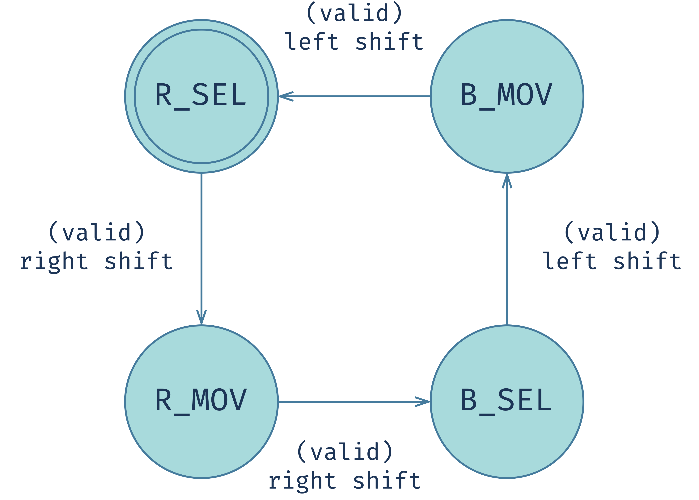

正式的象棋遊戲中，每一回合，紅方先提起手拿一己方陣營之棋子，拿起後該回合不可改拿其他子（起手無回大丈夫）。接著紅方將棋子放置在空位來移動棋子，或者吃掉黑方陣營的棋子：將手拿之紅棋壓於黑棋之上並抽掉黑棋，此時紅方行動結束，輪到黑方進行相同行為。故我依照現實情況，將遊戲主邏輯分成四種狀態：紅方取子 $\rightarrow$ 紅方走子 $\rightarrow$ 黑方取子 $\rightarrow$ 黑方走子 $\rightarrow \cdots$。

象棋規則中，紅方先行，故起始於 `R_SEL`：紅方取子狀態。

紅方藉由遍歷紅方游標至紅子後按下 `rshift`（右 `shift` 鍵）方可選擇要移動此棋子，進入 `R_MOV`：紅方走子狀態，此時被選定子的位置將被賦予游標選定特效（藍色），直至紅方走完畢。

`R_MOV` 狀態下紅方藉由遍歷紅方游標至目標位置後按下 `rshift` 後，方可移動棋子或吃子，其細節狀況有三：

1. 目標處無子（實作上透過訪問 `chess_ram` 來確認）：移動至目標位置，實作上以以被選中之 `chess_ram` 上的值覆蓋目標位 `chess_ram` 中的值。
2. 目標處有敵子（實作上透過訪問 `chess_ram` 來確認）：吃掉敵子，實作上以以被選中之 `chess_ram` 上的值覆蓋目標位 `chess_ram` 中的值。
3. 目標即原位：無法觸發移動或吃子效果，也不會進行狀態轉移，符合常識邏輯。實作上只在符合前兩種情況下，`rshift` 才會觸發狀態轉移的效果（即狀態機圖中的 `(valid)`）。

除了對棋子的修改，同時也要對 `effect_ram` 作出調整。實作上，原本被選之棋原位的特效會被復原成

1. 若原位與敵方游標在相同位置，則將 `effect_ram` 復原為敵方游標特效值。
2. 其他情況下將 `effect_ram` 的該位清空。

若觸發移動或吃子，則轉移至 `B_SEL`：黑方取子狀態，其行為比照紅方邏輯，透過 `lshift`（左 `shift` 鍵）來選子並轉移至 `B_MOV` 狀態。

`B_MOV` 狀態下與 `R_MOV` 狀態同理，僅將紅黑角色互換，透過合法的移動或吃子來轉移回 `R_SEL` 狀態，長此以往，循環至遊戲結束。

特別注意到以上「變化」：雙方游標的移動與狀態的轉移，都是以雙方皆尚未取得對方主帥之首級為前提。若在 `R_MOV` 或 `B_MOV` 狀態中取得對方主帥之首級，則遊戲結束，`result` 將輸出 `R_WIN (1)` 或 `B_WIN(2)`，否則皆輸出 `PLAYING (0)`。而當 `result != PLAYING` 時，也就是勝負已分曉，則不會再有「變化」，等待使用者觸發全域重設後初始化棋局。

要實作遊戲結束的邏輯，首先判斷 `R_MOV` 或 `B_MOV` 狀態中是否取得對方主帥之首級，可在吃子的狀況下新增額外的判斷電路來完成，並透過改變下個 clock 的 `result` 值來傳遞結果。而要實作不再「變化」的邏輯，僅需在上述所有變化前添加一個 MUX：當 `result == PLAYING` 時才會在下個 clock 中把變化的值寫入各個 DFF 與 RAM。

另外注意，此 `result` 直接對應到 `Main` 的 `LED[1:0]`，也就是當紅方勝出時，`LED[0]` 會亮起；當黑方勝出時，`LED[1]` 會亮起。

最後，由於我們設計出四個狀態，因此狀態的實作上可以透過一個 $2$ bits 的 DFF 來完成。

#### `TimerManager` 狀態機

為了模組化開發的便利性與穩定性，我將遊戲計時器 `TimerManager` 的邏輯分開實作，並由 `GameLogic` 模組來調用。

在正規的雙計時器象棋比賽中，雙方各會被分配一組計時器：局計時器與回合計時器。前者限制一方在此局的總花費時長，後者限制一方每一著的時長。時間上並沒有一致的規定，以主辦方公佈的為準。

故我以現實為模板，設計兩組局／回合計時器，對方行動時己方的計時器會被停止；輪到我方時，局計時器會正常倒數，回合計時器會重設後開始倒數。重設值根據局計時器有以下可能

1. 局計時器時間大於一分鐘 $\rightarrow$ 重置為一分鐘
2. 局計時器時間小於十五秒 $\rightarrow$ 重置為十五秒
3. 其他 $\rightarrow$ 重置為與局計時器同時

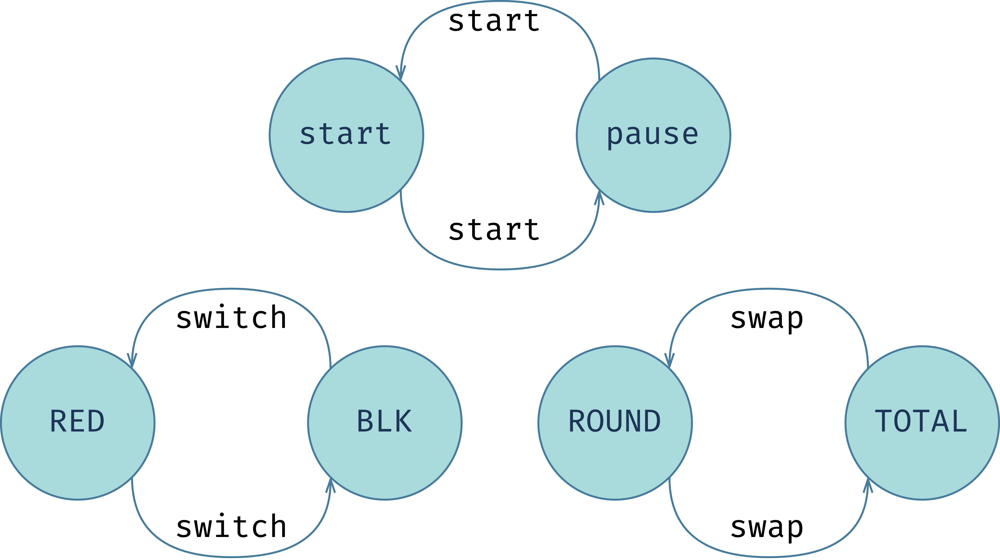

再來，`TimerManager` 計時器模組應該提供開始、暫停的功能，因此我設計 `start` 接口，模組使用者可以透過一個時脈的 true 來切換開始與暫停的狀態。實作上可以透過上圖上方的狀態機完成。

為了感知切換玩家的行為，我為此模組設計 `switch` 接口，提供模組使用者用一個時脈的 true 來觸發切換玩家。實作上可以用上圖左方的狀態機完成。

考量到我將以兩種方式讀取此模組的輸出：七段顯示器與 VGA 數位七段顯示器，我額外為此模組加上 `clock` 輸出接口來兼容 `SignalIterator` 模組，以及 `swap` 輸入接口來感知模組使用者切換顯示時鐘的訊息。實作上可以透過上圖右方的狀態機完成。

#### `TimerManager` 深度模組化設計

為了善用模組化復用性的長處，此模組內部採取深度模組化的方式設計並實作。

讓我們抽象的思考：要實作兩組局／回合計時器，需要四組功能很相似的倒數計時器。而計時器在過去 Lab 6 已經實作過，當時我也採用深度模組化設計：以一位高度客製化（參數化）的數字模組 `OneDigitCounter` 為基礎的極致模組化，故我可以以該模組為基礎，參考 Lab 6 自己使用該模組組合出的模組：`SetHourClock` 為雛形，實作出自 `60:00` 開始倒數、暫停的局計時器 `HourClock`，以及自 `01:00` 開始倒數、暫停以及注入數值的回合計時器 `RoundClock`。

有了局計時器與回合計時器的雛形，我設計 `PlayerTimer` 模組來調用這兩個計時器，成為一方玩家的計時器模組。實作細節有三：

1. 計數與進位邏輯：由於兩個 `OneDigitCounter` 間傳遞進位與借位需要額外 $1$ 個 clock，這導致兩個計時器都需要額外 $1\sim 3$ 個 clock 來完成借位工作，故我利用 $100Hz$ 時脈的 clock，相當於把一秒分成 $100$ 個 clock，其中前 4 個 clock 就可以保證借位變化完成。注意到我引入一個循環遞增至 $100$ 的一組 DFF：`cnt`，來實現每 $100$ 個 clock 通知兩個計時器進位（給予 enable true）的邏輯。

2. 歸零時暫停計數：方才提到 `cnt` 的設計，簡化了分別為兩個計時器實作歸零暫停的邏輯：為 `cnt` 的 next clock value 增加一個 MUX，若數到零時， `cnt` 就保持為零，也就無法給兩個計時器 enable。

3. 切換玩家時的計數邏輯（調用兩個計時器的方法）：當 `PlayerTimer` 的 enable 由 $0$ 變為 $1$ 時，表此計數器對應的玩家正要開始行動。此時要將回合計時器重設為下列值：
   
   1. `01:00`：局計時器時間不小於一分鐘
   2. `00:15`：局計時器的值小於 $15$ 秒
   3. 局計時器的值：其他情況
   
   設計上我以「捕捉 `PlayerTimer` 之 enable 的正緣」為出發點，成為給 `RoundClock` 模組注入數值的條件，注入方法為使用我為該模組設計的 `to_inject` 和 `inject_num` 接口。實作上我以一個 DFF 捕捉 `PlayerTimer` 之 enable 在上一個時脈的值，並與當前 enable 的值一起跑段：只有在當前 enable 為 true 且上一個時脈的 enable 為 false 的情況下才會為 `RoundClock` 注入數值。注入之數值可以透過一個 MUX，以局計時器的輸出值為判斷條件。

如此一來，透過適當的調用兩個深度模組化出的單一玩家計時器 `PlayerTimer`，雙方的比賽計時器 `TimerManager` 便能完成正確的邏輯，同時獲得最高的開發效率與正確性。

#### 大盤暗棋邏輯

大盤暗棋是象棋規則的擴展，是將暗棋與正規象棋的規則結合的產物。

規則上新增兩大要點：

1. 雙方使用者可以在自己的選擇狀態時（`R_SEL` 或 `B_SEL`）選擇任意處於覆蓋狀態下的棋子，並翻為正面，無論此子是否屬於己方陣營，並轉移狀態至對方的選擇狀態。實作上可透過於 `R_SEL` 或 `B_SEL` 狀態下，讀取並修改行動方游標所在位置之 `chess_ram` 的值來完成。
2. 暗吃：可以攻擊覆蓋的棋子，若陣營相同則等同於翻棋子，若不相同則吃子，且為了增進遊戲複雜與趣味性，雙方玩家都無法知曉被吃之子為何。實作上透過於 `R_MOV` 或 `B_MOV` 狀態下，判斷行動方游標於 `chess_ram` 中的值，決定是要翻子：將棋子資料的最高位設為 `0 (SHOWING)`，還是覆寫行動方選擇之子。

由上述設計與實作分析，我們可以透過新增邏輯電路，將原本大盤的邏輯擴展成大盤暗棋的規則。

#### 隨機棋子邏輯

為了增加遊戲的趣味性與貼近經典小盤暗棋的「隨機」性，我引入隨機棋子生成器 `RandomChessGenerator` 來完成「洗棋」邏輯。

由過去對棋子資料結構的設計分析，我們知道在不考慮是否覆蓋的情況下，棋子含空子有 15 種，因此一個棋子可以用 $4$ bits 來表示。而棋盤上，單一方有將一隻，士象車馬炮各兩隻，卒五隻，即棋盤上共有 $16+16=32$ 個棋子。因此我們需要一個能產生 $32$ 個不同數字的亂數生成器。

對此，我有兩個設計思路：

1. 採用 $5$ bits（五階）的 [LFSR](https://en.wikipedia.org/wiki/Linear-feedback_shift_register)，參考維基百科提供的生成多項式 $x^5+x^3+1$，作為能產生 $31$ 個亂數的亂數生成器為基礎，經過 $31$ 個 clock 便可以產生出 31 個不同的非零輸出，也就是將 $1 \sim 31$ 亂序，利用此亂序好的陣列，我們可以使用一個 MUX ，將數字映射成棋子的資料結構，來構建出 $32$ 個棋子亂序的棋子陣列。注意到由於 LFSR 無法生成 $0$，差的那一個棋子就放置於固定位置，也就是該棋子無法參與亂序。

2. 透過更高階的 LFSR 產生更多數字的亂序（如七階 $1\sim127$ 亂序），搭配 filter 來過濾掉我們不要的數字，產生 $32$ 個數字亂序，再應用方才提到的 MUX 來轉換成對應的棋子。此法優缺點分析如下：
   1. 更好的隨機性：能夠產生更多不同的隨機組合。
   2. 去除 Glitch：原本有一顆棋子無法參與亂序的問題得到解決。
   3. 巨量的空間消耗：由於需要一個龐大的 DFF 來儲存亂序序列，當 LFSR 的階數越大，空間複雜度程指數級別增長。
   4. 需要更多 clock 與額外電路才能完成 filter 的工作，增加時間、空間複雜度。

我主要考慮第三、四點帶來的損失，故保留以五階的版本。

另外注意，本 `RandomChessGenerator` 乃至於 `GameLogic` 有一輸出為 `ready`，為 $1$ 時表示已經亂序完畢（因為亂序是 Sequential 電路），為 $0$ 則表示正在亂序中。

以下附上相關截圖。

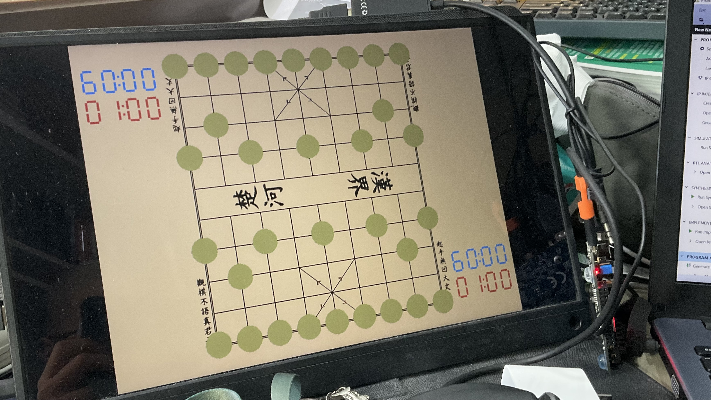

### `DisplayEngine` 前端架構

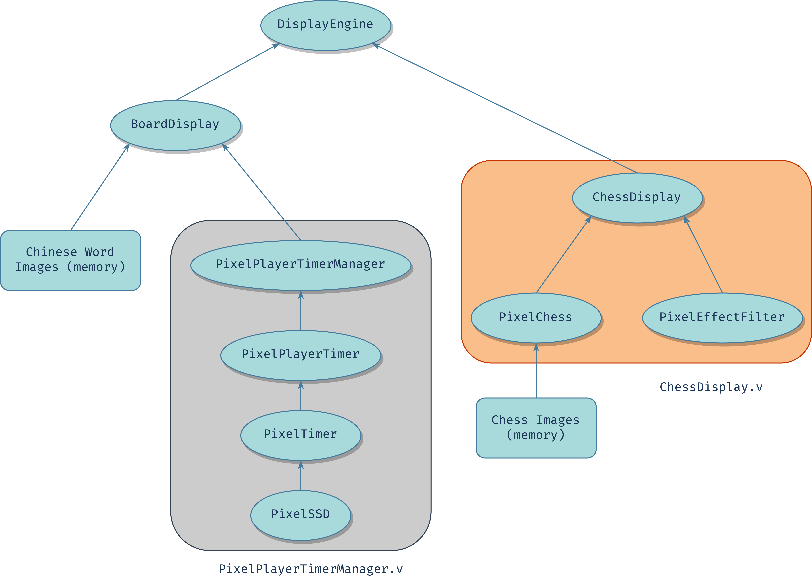

#### 樹狀圖層的設計

在獲得給定模組 `vga_controller` 的縱橫掃描訊號後，我們得決定要輸出的像素值為何。由於本象棋遊戲的顯示物件很多種：背景棋盤、漢字美化、棋子與特效資料結構的顯示、比賽計時器、勝方圖示等，故我引入「圖層」的概念，分為與棋子無關的 `BoardDisplay` 圖層和針對棋子與特效的 `ChessDisplay` 圖層（同時也是模組名稱）這兩個圖層又可以分別細分成多個圖層，列舉如下：

1. `BoardDisplay` 圖層
   1. `PixelPlayerTimerManager` 計時器圖層
   2. 勝利圖層
   3. 周圍漢字塗層
      1. 觀棋不語真君子圖層
      2. 起手無回大丈夫圖層
   4. 中心漢字塗層
      1. 楚河圖層
      2. 漢界圖層
   5. 棋盤線圖層
      1. 外圍雙層線圖層
      2. 內部網格線圖層
      3. 炮砲定位線圖層
      4. 兵卒定位線圖層
      5. 九宮格斜線圖層
2. `ChessDisplay` 圖層
   1. `PixelChess` 棋子圖層
   2. `PixelEffectFilter` 特效圖層

定義好以上圖層後，實作上可以使用類似樹資料結構的概念：自葉圖層開始，透過各個圖層去讀取當前掃描訊號的位置，產生合法性訊號，向上傳遞至根圖層（`DisplayEngine` 模組），來層層決定要顯示哪一層的像素。

不過具體實作上遇到了數不清的阻礙，這部分有待問題與討論展開。

#### 遍歷圖型的方法

我們知道由 `vga_controller` 產生的縱橫掃描訊號為逐行橫向遍歷，任何情況皆然，故我們可以設計一個遍歷圖形的思路模板，以供所有訪問記憶體的圖形遍歷參照。

對於一個長方形圖片，每當：

1. 掃描訊號遍歷至合法 $x$ 範圍（此時不用考慮 $y$ 範圍）時，我們可以不斷的隨掃描來遞增訪問記憶體的位址。
2. 掃描訊號遍歷至合法 $y$ 範圍時，保持訪問記憶體的位址不動，等待同時掃描到合法的 $x$ 範圍以繼續遍歷出記憶體的像素。
3. 不符合以上情況時，保持訪問記憶體位址為 $0$。

這樣的設計典範：樹狀圖層與遍歷方法，成為我實作圖片顯示的範本。

## 問題與討論

本 Final Project 完全由個人從頭摸索至完成，也因此遇到種種的問題，透過花費大量的時間設計、思考與妥協來一一解決。

### FPGA 記憶體不足

我認為要完成本 Final Project，第一件事就是完成前端的架構，如此一來後端的設計才能獲得檢驗，故我先從前端著手設計與實作。

但我馬上就遇到問題，以下是我在 Proposal 提供的棋盤圖。


在 Block Memory Generator 這關，我發現自己無法照標準流程生成上圖的 Block Memory。

經過上網搜尋後，發現原因是我的棋盤圖解析度過大 ($1200 \times 1200$)，超越此 FPGA 板能提供的記憶體限制。因此我嘗試將圖片盡可能的修剪多次，但都無法在畫質與空間消耗上取得滿意的結果。

最後，由於我觀察到「JPG 檔對圖片的有損『壓縮』效果，導致我修圖後的圖片之檔案大小有可觀的變化」這件事，給我提供靈感：既然棋盤圖只有兩種顏色：黑色與木色，那何不直接來個極致壓縮，只要決定黑色的位置即可，省得浪費大量記憶體去存一樣的東西。

所以我轉換思路，直接以組合電路構建易於以數學描述的格線，以及較為複雜的漢字圖。對於前者，我需要找到數學函數來決定當前掃描的位置是否輸出黑色；對於後者，除了其本身面積已經很小以外，「觀棋不語真君子」與「起手無回大丈夫」事實上可以透過旋轉來復用圖檔，近一步減少記憶體消耗。

### Hardcode 棋盤、時鐘繪圖的策略

為了實現極致壓縮，我設計棋盤定位，以數學函數、組合電路 Hardcode 來繪製棋盤格線，並對數個漢字圖定位，來輸出正確像素。

但作為一個資工系的學生，總是不希望自己的程式碼出現太多 Magic Number，因此我先為 `BoardDisplay` 棋盤繪圖模組定義數個可客製化之 `parameter`，來輔助我定位棋盤，並建立數學函數：

```verilog
parameter GRID_DIFF = 45,  // 一個 Grid 的邊長
parameter OUTER_WIDTH = 2, // 外邊線與內邊線的距離
parameter H_OUTER_0 = 138, // 左外邊線基礎 x 值
parameter H0 = H_OUTER_0 + OUTER_WIDTH, // 以下皆為 x 向定格值
parameter H1 = H0 + GRID_DIFF,
parameter H2 = H1 + GRID_DIFF,
parameter H3 = H2 + GRID_DIFF,
parameter H4 = H3 + GRID_DIFF,
parameter H5 = H4 + GRID_DIFF,
parameter H6 = H5 + GRID_DIFF,
parameter H7 = H6 + GRID_DIFF,
parameter H8 = H7 + GRID_DIFF,
parameter H_OUTER_1 = H8 + OUTER_WIDTH, // 右外邊線基礎 x 值
parameter V_OUTER_0 = 35,  // 上外邊線基礎 y 值
parameter V0 = V_OUTER_0 + OUTER_WIDTH, // 以下皆為 y 向定格值
parameter V1 = V0 + GRID_DIFF,
parameter V2 = V1 + GRID_DIFF,
parameter V3 = V2 + GRID_DIFF,
parameter V4 = V3 + GRID_DIFF,
parameter V5 = V4 + GRID_DIFF,
parameter V6 = V5 + GRID_DIFF,
parameter V7 = V6 + GRID_DIFF,
parameter V8 = V7 + GRID_DIFF,
parameter V9 = V8 + GRID_DIFF,
parameter V_OUTER_1 = V9 + OUTER_WIDTH  // 下外邊線基礎 y 值
```

由這些基礎定位線，我們可以優雅的使用並推導出其他重要隔線，注意到以下使用 `localparam` 是為了模組的封閉性：

```verilog
localparam V_MID = (V4 + V5) / 2; // 中心 v
localparam RIVER_VU = V_MID - 20; // upper v of river
localparam RIVER_VL = V_MID + 20; // lower v of river
localparam RIVER_LL = H2 - 40;    // left bound of 楚河
localparam RIVER_LR = H2 + 40;    // right bound of 楚河
localparam RIVER_RL = H6 - 40;    // left bound of 漢界
localparam RIVER_RR = H6 + 40;    // right bound of 漢界

localparam V_BASE_UU = V0; // 上方漢字句子的 y 上界
localparam V_BASE_UL = V0 + 100; // 上方漢字句子的 y 下界
localparam V_BASE_LU = V9 - 100; // 下方漢字句子的 y 上界
localparam V_BASE_LL = V9;  // 下方漢字句子的 y 下界

localparam H_BASE_LL = H0 - 20; // 左側漢字句子的 x 左界
localparam H_BASE_LR = H0 - 5;  // 左側漢字句子的 x 右界
localparam H_BASE_RL = H8 + 5;  // 右側漢字句子的 x 左界
localparam H_BASE_RR = H8 + 20; // 右側漢字句子的 x 右界
```

下方的示意圖進一步說明這些參數的意義。

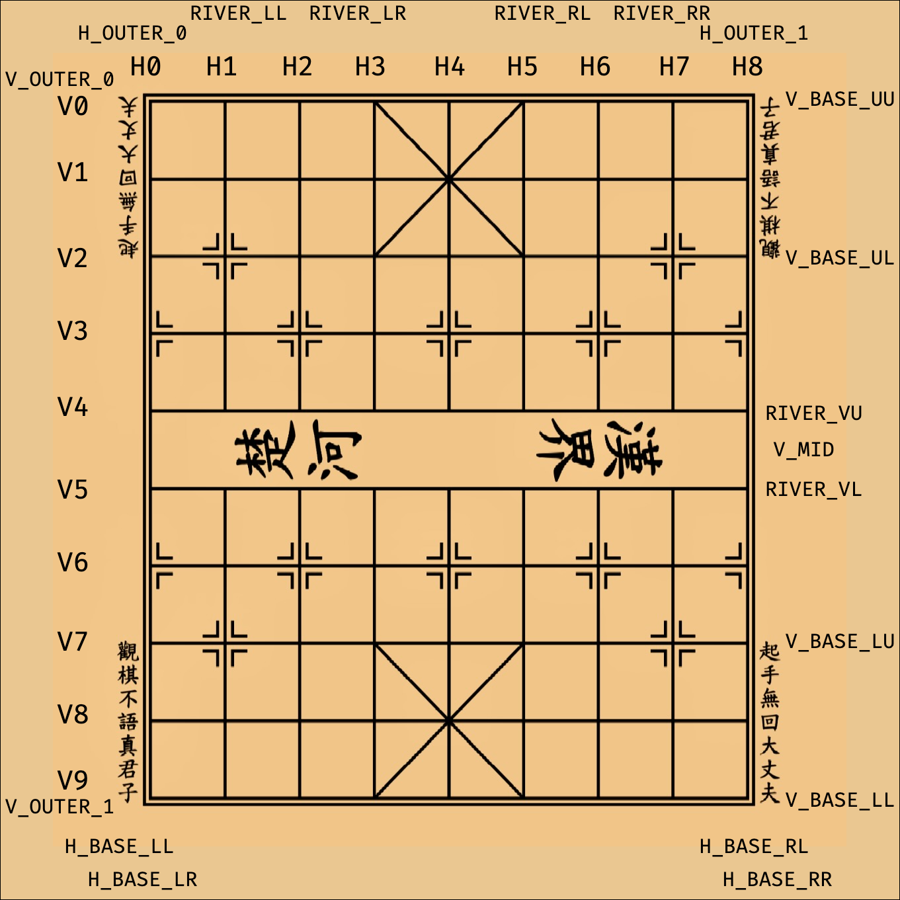

定義好以上縱橫定位值後，繪製這些隔線的數學函數就呼之欲出。

較為簡單的橫豎線斜線我不一一列舉，我以九宮格斜線和兵卒定位線為例。

九宮格斜線中，上方的由右上至左下的斜線之數學表達為
$$
\textrm{valid}(h, v) = \begin{cases}
1, & h + v = \textrm{H5} \\
0, & otherwise
\end{cases}
$$
注意這裡個 $h, v$ 為橫、豎座標基於 $\textrm{H0, V0}$ 的相對位置。

又如兵卒定位線乃至於炮砲的定位線，可以看成由二或四個 $L$ 型線組合而成，但我進一步將其看成是兩個方形的疊合，大者為黑方型，小者為木色方形。只要清楚要如何繪製正方形，便能應用相同的邏輯，加上圖層疊合的概念，得到其數學表達
$$
\textrm{valid}(h, v) = \begin{cases}
1, & \textrm{inBlackSquare}(h, v) \land \textrm{notInYellowSquare}(h, v) \\
0, & otherwise
\end{cases}
$$
由以上兩的例子，顯示我透過將這些隔線分成不同圖層的概念，用在實作上就是針對各種隔線圖層實作「界線繪製」與「合法性位元」，並在 `BoardDisplay` 的最後以一個大 MUX 來選擇要輸出的內容。

### 將軍命名問題

因為不明原因，我原本將黑方將軍的 Block Memory 命名為 `general_bk_mem`、紅方將軍的命名為 `general_rd_mem`，但 Vivado 總是不讓我生成。

經過查詢，嘗試過種種辦法，諸如壓縮圖片大小、改變圖片底色、變更圖源資料夾等（本來就全部在全英文路徑）都苦無效果。

直到我嘗試將 Block Memory 的名稱改成 `GeneralBK` 和 `GeneralRD` 後，問題莫名其妙得到解決，至今仍未清楚為何命名會有如此結果（名稱長度這個可能性確定可以排除，因為象的名稱 `elephant_bk_mem` 和 `elephant_rd_mem` 更長）。

### 圖形顯示相關之合成過久

雖然優先實作前端可以幫助我儘早進入 GUI 除錯階段，但自從引入數張圖檔後，FPGA 的運行速度明顯拖長很多，單次電路合成需要十分鐘至三十分鐘不等，這導致每一次更新都很難及時得到回饋。

對此，我改變思路，利用更細緻的模組化，對不必使用 GUI 的重要模組進行獨立測試，透過其他輸出方式來除錯，成為較可行的方法。

`TimerManager` 便是一個好很的例子，先純粹使用七段顯示器獨立建立專案並除錯，而後合併進本 Final Project，此時的 `TimerManager` 已經是擁有正確性的模組，因此可以用來進一步為 Final Project 本身除錯。

另一個例子是我額外希望實現的 `MyCPU`，不過最後的開發以失敗收場，這將放在後面說明，這樣分別實作思路也可以避免主專案被有問題的模組影響。

### 圖片處理細節

#### 顏色通道位寬不足 $\rightarrow$ 校色

由於 FPGA 上的記憶體過少，導致我們只能放低解析度的圖片，時常需要對圖源進行壓縮。這意味者圖源的失真性會進一步的提高，進而使最後呈現的圖品質過差。對於重視軟體外觀的我而言，這實在不夠優雅。

因此我沿用過去針對棋盤繪圖的思路為契機：「因為棋盤本身只有兩種顏色，所以只要允許兩種顏色的像素被輸出即可。」，透過「整流」的作法，針對 RGB 通道都高於一定閾值的的顏色全部變成木色，單單 R 通道高於一定閾值的顏色變為同一種紅色，其餘都變成黑色。

這樣的效果確實比原本好一些，但對漢字複雜的一撇一捺卻產生副作用：不是漢字變胖就是變瘦的不自然。

因此我調整上述規則的彈性：保留低於某閾值的顏色，如此一來，一撇一捺顯得更有力量且更加自然。

#### 形狀問題與去背

對於棋子和勝利圖示，我們需要實作圓形的圖層，對此我想到兩種方法。

1. 利用畢氏定理，使用乘法電路來完成，但用起來的效果非常差，很容易因為圖源的位置偏差導致切或者留過頭，且可以發現圓周被硬生生的切成肉眼可見的階梯邊，實在不怎麼優雅。
2. 沿用前面整流的概念，將圖源的背景設為白色，並在整流時轉為棋盤木色，且設定其 `valid` 為 $0$，如此一來便會自然的將外緣切割，效果與前者相比十分卓越。

又由以上的經驗，我將勝利圖的底色設為深黑色，只有在掃瞄出的顏色大於某閾值才會輸出，並設定 `valid` 為 $1$，效果也不錯。

以下是完成這些內容的階段性截圖。

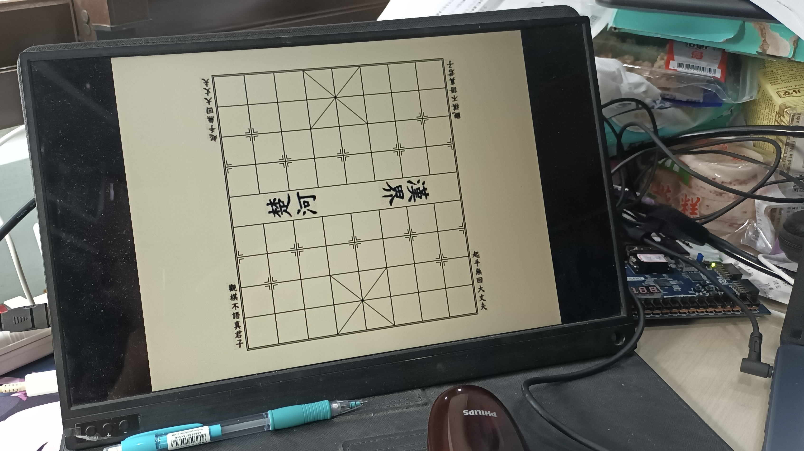

#### 低級錯誤：`wire` 未指定長度

在本次 Final Project 的前期，我善用 `wire` 為我提供 RTL code 易讀性的好處，但同時也帶來了麻煩：有幾個 `wire` 變數忘記指定其大小，導致

1. 圖片顯示為黑，因為 1 bit 無論 $0, 1$ 都一般黑。
2. 某些狀態轉移錯誤，因為 next state value 的 `wire` 僅長 $1$ bit

一個很「鮮明」的例子如下，在此 Project 已經發生了多次，無論是在棋子抑或計時器 ...

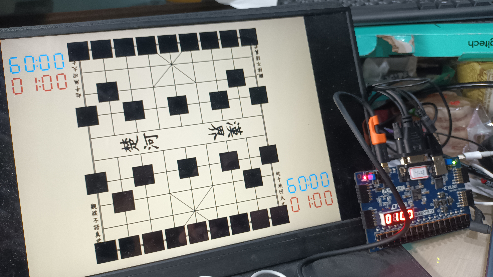

### 合法性偵測：FPGA LUT 不足

本來希望能實現落子合法性偵測與繪製，在實作將士象馬兵時，可以感受到燒板子所花的時間明顯增長，等到實作一隻車（車的走子與吃子的邏輯判定十分複雜，我的設計需要額外的 DFF，透過追蹤單隻車的位置來判定）時，久久都燒不出結果。

乾等良久後，Vivado 才總算警告我 LUT (Look Up Table) 不足，這讓我非常震驚，因為花費許久設計出的邏輯竟然無法被燒到板子上。

於是我開始試圖變化設計思路：利用序向電路，也就是使用更多 DFF，透過更多 clock 產生計算結果，以時間換取空間。這樣的思路確實奏效，我可以時做一隻車到板子上，並正確的判定合法性。

以下為當時的截圖。

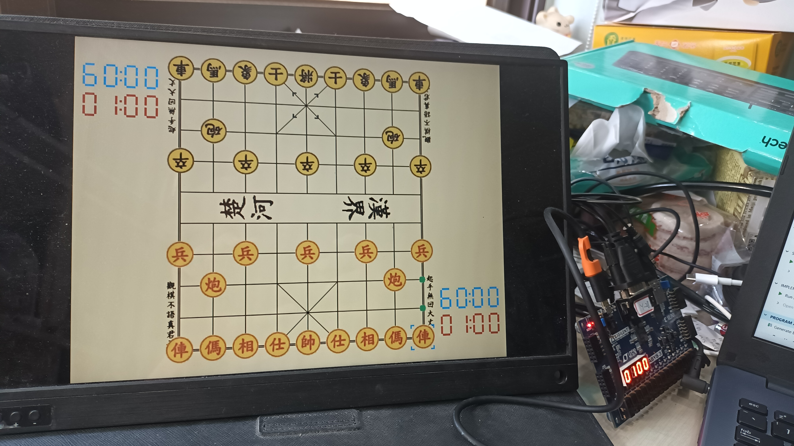

就當我以為我又能繼續邁進時，悲劇就發生了：第二隻車還是實作不出來，LUT 又不足了。因此我決定嘗試設計指令集、實作 CPU，並以自製的組合語言來執行我的目標，也就是，把時間換取空間的思路發揮到極致。

### 單步 CPU 實作紀錄

#### 指令集設計

基於我本學期修計算機結構的 RISC-V 知識，我決定採用 RISC-V 指令集裡的 16 個重要指令，我的手稿如下：

|                           Script                            |                          Definition                          |
| :---------------------------------------------------------: | :----------------------------------------------------------: |
| 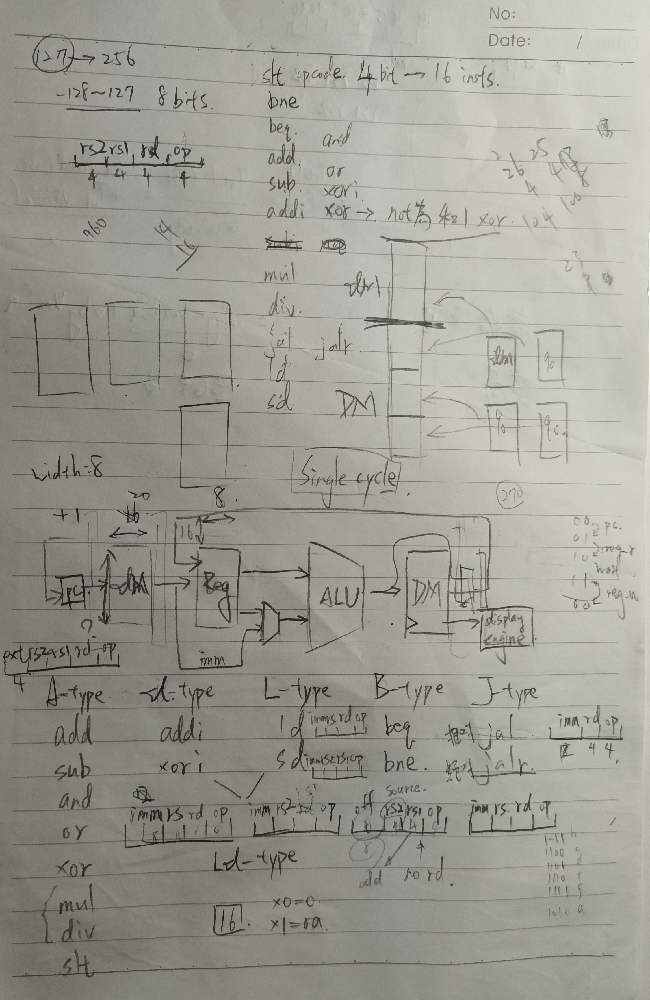 | 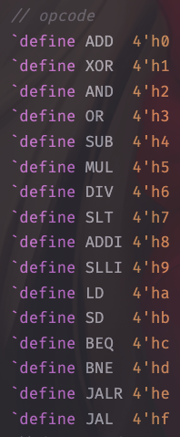 |

為了實現經典的單步 CPU (none pipeline)，我將 CPU 分出三個模組：`InstructionMemory`, `ALU`, `DataMemoryManager`，而 $ID$ 和 $WB$ 階段的 registers（我設計 16 個 registers）直接包含於 `MyCPU` 模組中。注意到 `DataMemoryManager` 的名稱，對於透過最前面的模組架構圖而理解我命名習慣的朋友，想必一定很清楚那也是模組化的產物：由兩個 `DataMemory` 組成。

而對於此 CPU 的 IO，我用一個很有趣的設計：將 keyboard encode 後永遠存入 register[15]，這樣當 CPU idle 時就可以透過讀取 register[15] 來觸發下一步動作。

透過長時間的開發，與指令集欄位的調整，我成功運行數行簡單的組合語言，但此時已經花費過多時間，且還有數個未解決的 Bug 尚待研究。更重要的是，要手刻組組合語言在 `wire` 變數中，且沒有 tag 的幫助，實在過於煎熬，因此我在此打住，僅經驗永流傳。

### 二維 RAM 的使用與細節

本 Final Project 使用多次 RAM。

#### 宣告與使用

此 FPGA 支援二維 $1$ bit 深度的隨機訪問記憶體，像是

```verilog
// in GameLogic module
reg [`CHESS_LEN-1:0] chess_ram [`BOARD_R-1:0][`BOARD_C-1:0];

reg [`EFFECT_LEN-1:0] effect_ram [`BOARD_R-1:0][`BOARD_C-1:0];
```

表面上看起來是 $5$ 和 $2$ bits 深度的二維隨機訪問記憶體，這是不支援的。不過 Vivado 會幫我們處理成 index 乘法，而省去我們粗暴的四處寫乘法，導致程式碼不易閱讀，故我繼續採用這個看似不支援的語法。

於是我們就可以方便地利用 RAM 的特性來訪問並修改資料，舉例如下。

```verilog
// 方向鍵邏輯
// 紅方方向鍵
if (s_key_up | l_key_up) begin
    nxt_effect_ram[ry][rx] = is_r_selected ?
        `SELECTED : same_place ? `B_TRAV : `NO_EFFECT;
    nxt_effect_ram[ry_up][rx] = 
        effect_ram[ry_up][rx] == `SELECTED ? 
            `SELECTED : `R_TRAV;
    nxt_ry = ry_up;
end
```

#### 對外接口的處理

隨機訪問記憶體顯然是無法成為模組對外連線的一部分，故我們需要「疏理排線」來將二維（考慮深度就是三維）的記憶體壓成一維的排線。追求程式碼易讀性的我使用 `generate` 來完成這項工作，舉例如下。

```verilog
// in GameLogic Module
//    output [`CHESS_MAP_WIDTH-1:0] chess_arr,
//    output [`EFFECT_MAP_WIDTH-1:0] effect_arr,

// assign memory to array
genvar i, j;
generate
    for (i = 0; i < `BOARD_R; i = i + 1) begin
        for (j = 0; j < `BOARD_C; j = j + 1) begin
            assign chess_arr[
                    (i*`BOARD_C + (j+1)) * `CHESS_LEN-1:
                    (i*`BOARD_C +   j  ) * `CHESS_LEN
                ] = chess_ram[i][j];
            assign effect_arr[
                    (i*`BOARD_C + (j+1)) * `EFFECT_LEN-1:
                    (i*`BOARD_C +   j  ) * `EFFECT_LEN
                ] = effect_ram[i][j];
        end
    end
endgenerate
```

#### 使用巨集優化巨型 RAM 的 Coding Style

因為我的 RAM 大小不俗，正常撰寫 DFF 的部分會顯得過於冗長而增加閱讀負擔，我希望能撰寫如下的程式碼：

```verilog
// in GameLogic module
always @(posedge user_clk, negedge rst_n) begin
    if (~rst_n) begin
        if (hidden_mode) begin
            `RST_CHESS_RAM_HIDDEN
        end
        else begin
            `RST_CHESS_RAM
        end
        `RST_EFFECT_RAM
    end
    else begin
        if (randomized & ~ready) begin
            `RST_CHESS_RAM_HIDDEN_RAND
        end
        else begin
            `ASSIGN_BACK_CHESS_RAM
        end
        `ASSIGN_BACK_EFFECT_RAM
    end
end

always @(*) begin
    `ASSIGN_CHESS_RAM
    `ASSIGN_EFFECT_RAM
    /* ... */
end
```

就如方才提到的，我們的 `chess_ram` 和 `effect_ram` 十分巨大，能改寫成如此得益於巨集定義的幫助，透過把這些基礎的 assignment 文字用 Python 等程式輔助生成，並宣告為巨集，大幅減低我們閱讀程式碼的負擔。

> Macro 真棒！

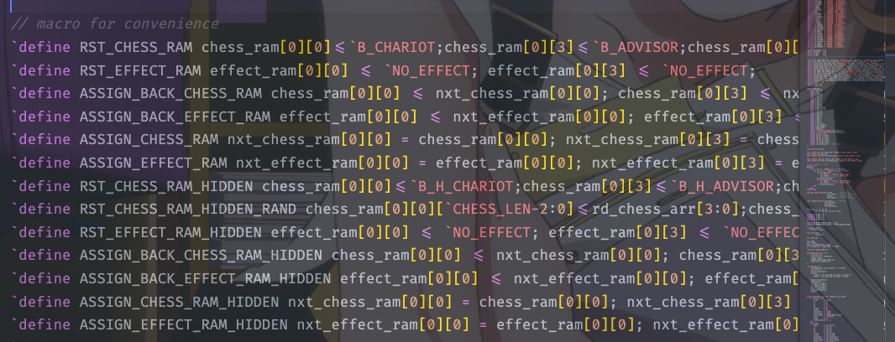
